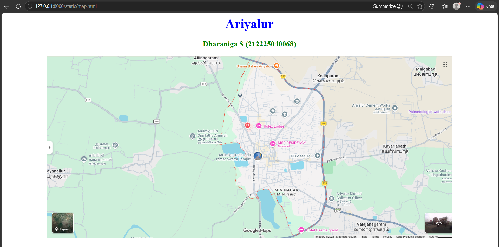
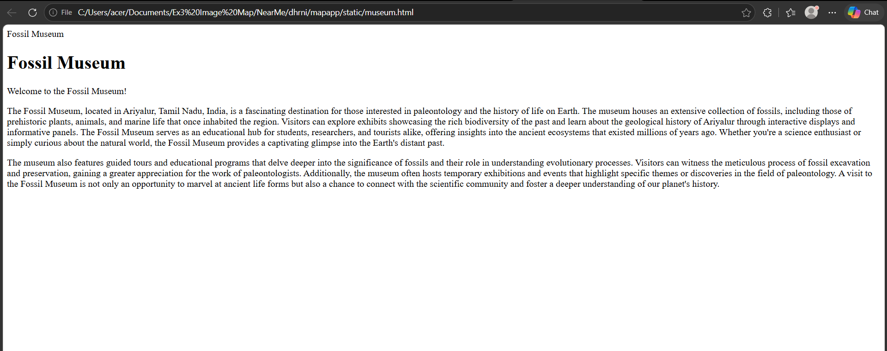
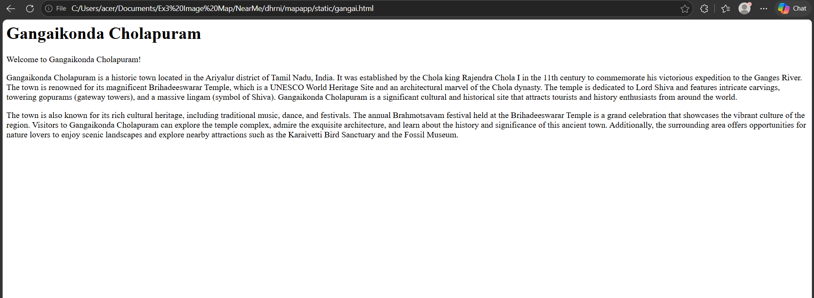
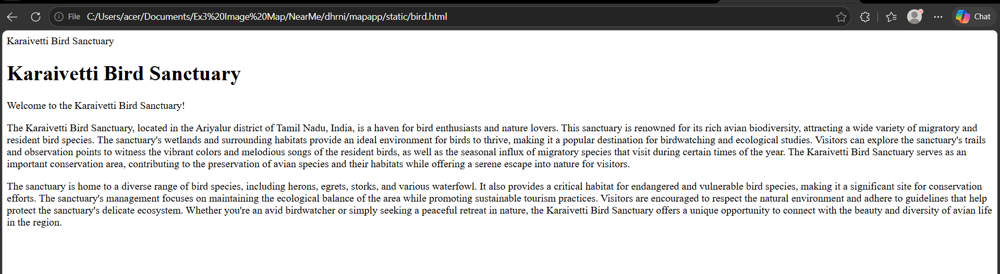

# Ex03 Places Around Me
## Date: 28/05/2026
## Name: Dharaniga S (212225040068)

## AIM
To develop a website to display details about the places around my house.

## DESIGN STEPS

### STEP 1
Create a Django admin interface.

### STEP 2
Download your city map from Google.

### STEP 3
Using ```<map>``` tag name the map.

### STEP 4
Create clickable regions in the image using ```<area>``` tag.

### STEP 5
Write HTML programs for all the regions identified.

### STEP 6
Execute the programs and publish them.

## CODE
```
map.html

<html>
    <head>
        <title>My City</title>
    </head>
    <body>
        <h1 align="center">
            <font color="blue"><b>Ariyalur</b></font>
        </h1>
        <h3 align="center">
            <font color="green"><b>Dharaniga S (212225040338)</b></font>
        </h3>
        <center>
            
            <map name="Ariyalur-map">
            <area target="bird.html" alt="Karaivetti Bird Sanctuary" title="Karaivetti Bird Sanctuary" href="https://en.wikipedia.org/wiki/Karaivetti_Bird_Sanctuary" coords="1019,810,71" shape="circle">
            <area target="museum.html" alt="Fossil Museum" title="Fossil Museum" href="https://www.tamilnadutourism.com/attractions/arts-museum/fossil-museum.php" coords="1509,773,36" shape="circle">
            <area target="gangai.html" alt="Gangaikonda Cholapuram" title="Gangaikonda Cholapuram" href="https://en.wikipedia.org/wiki/Gangaikonda_Cholapuram" coords="1220,500,36" shape="circle">
        </map>
        </center>

    </body>
</html>
```

```
bird.html

<html>
    <head>
        Karaivetti Bird Sanctuary
    </head>
    <body>
        <h1>Karaivetti Bird Sanctuary</h1>
        <p>Welcome to the Karaivetti Bird Sanctuary!</p>
    </body>
    <p>
    The Karaivetti Bird Sanctuary, located in the Ariyalur district of Tamil Nadu, India, is a haven for bird enthusiasts and nature lovers. This sanctuary is renowned for its rich avian biodiversity, attracting a wide variety of migratory and resident bird species. The sanctuary's wetlands and surrounding habitats provide an ideal environment for birds to thrive, making it a popular destination for birdwatching and ecological studies. Visitors can explore the sanctuary's trails and observation points to witness the vibrant colors and melodious songs of the resident birds, as well as the seasonal influx of migratory species that visit during certain times of the year. The Karaivetti Bird Sanctuary serves as an important conservation area, contributing to the preservation of avian species and their habitats while offering a serene escape into nature for visitors.
    </p>
    <p>
    The sanctuary is home to a diverse range of bird species, including herons, egrets, storks, and various waterfowl. It also provides a critical habitat for endangered and vulnerable bird species, making it a significant site for conservation efforts. The sanctuary's management focuses on maintaining the ecological balance of the area while promoting sustainable tourism practices. Visitors are encouraged to respect the natural environment and adhere to guidelines that help protect the sanctuary's delicate ecosystem. Whether you're an avid birdwatcher or simply seeking a peaceful retreat in nature, the Karaivetti Bird Sanctuary offers a unique opportunity to connect with the beauty and diversity of avian life in the region.
    </p>
</html>
```

```
gangai.html

<html>
    <head>
        <title>Gangaikonda Cholapuram</title>
    </head>
    <body>
        <h1>Gangaikonda Cholapuram</h1>
        <p>Welcome to Gangaikonda Cholapuram!</p>
    </body>
    <p>
    Gangaikonda Cholapuram is a historic town located in the Ariyalur district of Tamil Nadu, India. It was established by the Chola king Rajendra Chola I in the 11th century to commemorate his victorious expedition to the Ganges River. The town is renowned for its magnificent Brihadeeswarar Temple, which is a UNESCO World Heritage Site and an architectural marvel of the Chola dynasty. The temple is dedicated to Lord Shiva and features intricate carvings, towering gopurams (gateway towers), and a massive lingam (symbol of Shiva). Gangaikonda Cholapuram is a significant cultural and historical site that attracts tourists and history enthusiasts from around the world.
    </p>
    <p>
    The town is also known for its rich cultural heritage, including traditional music, dance, and festivals. The annual Brahmotsavam festival held at the Brihadeeswarar Temple is a grand celebration that showcases the vibrant culture of the region. Visitors to Gangaikonda Cholapuram can explore the temple complex, admire the exquisite architecture, and learn about the history and significance of this ancient town. Additionally, the surrounding area offers opportunities for nature lovers to enjoy scenic landscapes and explore nearby attractions such as the Karaivetti Bird Sanctuary and the Fossil Museum.
    </p>
</html>
</html>
</html>
```

```
museum.html

<html>
    <head>
        Fossil Museum
    </head>
    <body>
        <h1>Fossil Museum</h1>
        <p>Welcome to the Fossil Museum!</p>
    </body>
    <p>
    The Fossil Museum, located in Ariyalur, Tamil Nadu, India, is a fascinating destination for those interested in paleontology and the history of life on Earth. The museum houses an extensive collection of fossils, including those of prehistoric plants, animals, and marine life that once inhabited the region. Visitors can explore exhibits showcasing the rich biodiversity of the past and learn about the geological history of Ariyalur through interactive displays and informative panels. The Fossil Museum serves as an educational hub for students, researchers, and tourists alike, offering insights into the ancient ecosystems that existed millions of years ago. Whether you're a science enthusiast or simply curious about the natural world, the Fossil Museum provides a captivating glimpse into the Earth's distant past.
    </p>
    <p>
    The museum also features guided tours and educational programs that delve deeper into the significance of fossils and their role in understanding evolutionary processes. Visitors can witness the meticulous process of fossil excavation and preservation, gaining a greater appreciation for the work of paleontologists. Additionally, the museum often hosts temporary exhibitions and events that highlight specific themes or discoveries in the field of paleontology. A visit to the Fossil Museum is not only an opportunity to marvel at ancient life forms but also a chance to connect with the scientific community and foster a deeper understanding of our planet's history.
    </p>
</html>
```

## OUTPUT






## RESULT
The program for implementing image maps using HTML is executed successfully.
